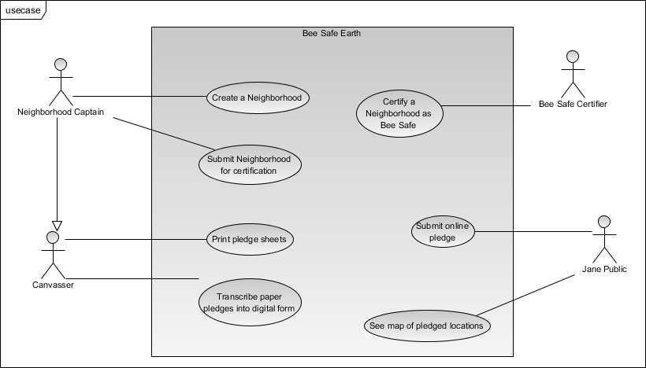
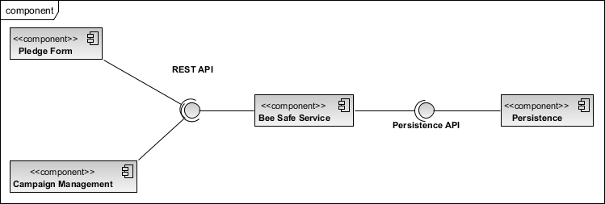
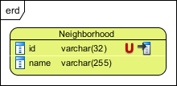

# Introduction

# Use Cases

The following usecase diagram introduces the actors on Bee Safe Earth and the high level use cases they can perform.

# Components

# Persistence

This diagram will show the conceptual "tables" and "columns" that need to be stored in the persistence layer. We have not yet decided on the type of database to use.

